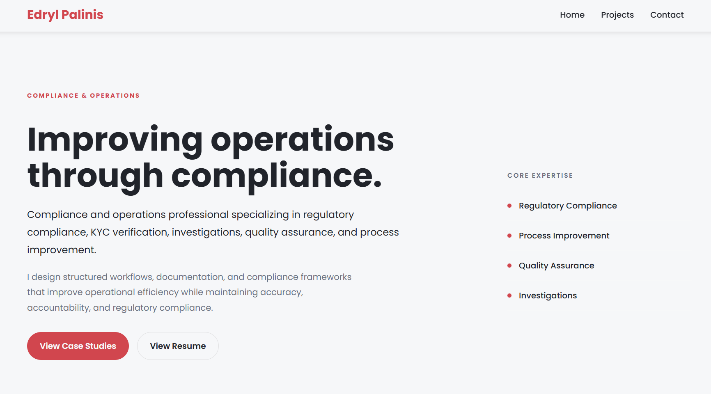

# Compliance Portfolio



## Live Demo

**Live Demo:** <https://compliance-portfolio-rosy.vercel.app/>

## About

This portfolio showcases my experience in regulatory compliance and highlights projects, professional certifications, and technical skills. It was built as a centralized place for recruiters and hiring managers to explore my work and professional development.

---

## Highlights

- Responsive design optimized for desktop, tablet, and mobile
- Modular component-based architecture using Vue 3
- Compliance project showcase
- Professional training and certifications with credential links
- JSON-driven content management
- Contact form powered by a serverless API
- Downloadable resume
- Lazy-loaded images for improved performance

---

## Built With

- Vue 3
- Vue Router
- Vite
- JavaScript
- HTML5
- CSS3
- Bootstrap 5
- Notyf
- Nodemailer
- dotenv
- Vercel

---

## Running Locally

```bash
git clone https://github.com/deyperfect/compliance-portfolio.git
cd compliance-portfolio
npm install
npm run dev
```

---

## Future Improvements

- Enhance accessibility
- Expand compliance project portfolio
- Improve animations and transitions
- Add additional professional certifications

---

## Contact

If you'd like to connect regarding career opportunities, feel free to reach out.

- Email: edrylpalinis@gmail.com

---
